<!-- J.A.R.V.I.S. — Sarath K GitHub Profile README -->

  

---

## 🏢 Experience

| Period | Role | Company | Highlights |
|--------|------|---------|------------|
| Recent | **Senior Mobile Developer** | Infosys *(Client: MyWorkplace)* | Enterprise app delivery, production features |
| Mid | **Mobile Developer** | Bpract Software Solutions | Multiple live Android & iOS apps shipped |
| Mid | **Mobile Developer** | Fast Programming *(Saudi Arabia)* | International apps: Swaptime, Dynate, Mabieat |
| Early | **Backend Developer** | PHP & API Projects | CodeIgniter, REST API architecture |

---

## 🚀 Featured Projects

<table>
<tr>
<td width="50%">

### 📊 BitcoinTAF
Crypto analytics — real-time charts, portfolio & push alerts.

`React Native` `Firebase` `REST API`

[▶ Play Store](https://play.google.com/store/apps/details?id=com.bitcointaf)

</td>
<td width="50%">

### 🧾 Sparissimo (MLM Platform)
Full MLM ecosystem — wallet, commissions, reports.

`React Native` `Node.js` `MySQL`

[▶ Play Store](https://play.google.com/store/apps/details?id=com.sparissimo)

</td>
</tr>
<tr>
<td width="50%">

### 🛒 Ellokart
Location-based e-commerce with real-time delivery tracking.

`Android` `Firebase` `Google Maps API`

[▶ Play Store](https://play.google.com/store/apps/details?id=com.ellokart.customer)

</td>
<td width="50%">

### 💪 FabFit
Fitness class booking — gym discovery, scheduling, payments.

`React Native` `Node.js` `Firebase`

[▶ Play Store](https://play.google.com/store/apps/details?id=com.bpract.fabfitapp)

</td>
</tr>
</table>

---

## 📫 Connect With Me

  
  &nbsp;
  
  &nbsp;
  

---

  

